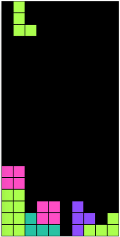

# tetris

A simple tetris clone written in TypeScript using native canvas and a little bit of Rx.js

[Demo](http://tetris.damnjan.dev)



### Usage

```javascript
const game = new Game(document.getElementById('canvas'))

game.start()

game.scoreSubject.subscribe(score => {
  console.log(`Score: ${score}`)
})

game.gameOverSubject.subscribe(score => {
  console.log(`Game over! Your score is ${score}`)
  game.stop()
  game.reset()
  game.start()
})

```
